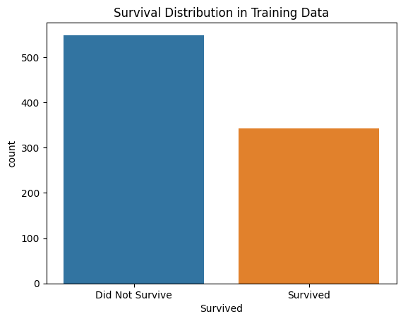

# **🚢 Titanic Survival Prediction 🌊**

This repository hosts a PyTorch-based neural network model designed to predict passenger survival on the Titanic. The project encompasses data preprocessing, model development, training, and generating submission files for the Kaggle Titanic competition.
My first ever deep dive attempt into the world of artificial neural networks !

## **📝 Table of Contents**

* [Project Overview](#bookmark=id.v0x0kp222w83)  
* [Features](#bookmark=id.abhyqo2ubeni)  
* [Dataset](#bookmark=id.r55fdzg9ydqj)  
* [Installation](#bookmark=id.rcrltjwvw2rq)  
* [Usage](#bookmark=id.dyvg9x1a25lt)  
* [Model Architecture](#bookmark=id.fs49jzgh57z4)  
* [Training](#bookmark=id.mmwyrrgqdyos)  
* [Results & Visuals](#bookmark=id.3zr1ff1qv3g5)  
* [Contributing](#bookmark=id.w95w9bghe25w)  
* [License](#bookmark=id.txphgrx0inyl)  
* [Contact](#bookmark=id.1qy8kvsix709)

## **🚀 Project Overview**

The core objective of this project is to build a robust classification model that can accurately predict whether a passenger survived the Titanic disaster based on various features. This serves as a classic introduction to machine learning and deep learning concepts, particularly for structured tabular data.

The titanic\_survival.ipynb script provides a complete pipeline, demonstrating:

* Comprehensive data loading and preprocessing using pandas and numpy.  
* Feature engineering, including handling missing values and categorical encoding.  
* A custom feed-forward neural network (nn.Module) built with PyTorch.  
* A structured training loop with Adam optimizer and BCELoss.  
* An early stopping mechanism to prevent overfitting and optimize training duration.  
* Evaluation metrics using torchmetrics.Accuracy.  
* Generation of submission files in CSV and XLSX formats.

## **✨ Features**

* **Data Preprocessing**: Handles missing values in 'Age' and 'Fare', extracts and cleans 'Cabin' data, and performs one-hot encoding for categorical features like 'Cabin' and 'Sex'.  
* **Feature Engineering**: Converts 'Sex' to numerical representation (Male: 1, Female: 0\) and processes 'Cabin' to its initial letter, treating unknown values as 'U'.  
* **Custom Neural Network**: A multi-layered perceptron designed for binary classification.  
* **Training Pipeline**: Implements a complete training loop with forward and backward passes, optimization, and metric tracking.  
* **Early Stopping**: Monitors validation accuracy to save the best model and stop training if no significant improvement is observed over a defined patience period.  
* **Submission Generation**: Automatically creates gender\_submission\_Titanic\_Survival.csv and gender\_submission\_Titanic\_Survival.xlsx files.

## **📊 Dataset**

The project utilizes the classic Titanic dataset from Kaggle, which typically includes:

* train.csv: Training data with passenger details and survival status.  
* test.csv: Test data with passenger details (survival status to be predicted).  
* gender\_submission.csv: A sample submission file.

The script automatically downloads these files using kagglehub.

**Key Features Used:**

* PassengerId: Unique identifier for each passenger.  
* Survived: Survival status (0 \= No, 1 \= Yes) \- *target variable in train.csv*.  
* Pclass: Ticket class (1 \= 1st, 2 \= 2nd, 3 \= 3rd).  
* Sex: Sex (male/female).  
* Age: Age in years.  
* SibSp: \# of siblings / spouses aboard the Titanic.  
* Parch: \# of parents / children aboard the Titanic.  
* Fare: Passenger fare.  
* Cabin: Cabin number.  
* Embarked: Port of Embarkation (C \= Cherbourg, Q \= Queenstown, S \= Southampton) \- *dropped in preprocessing*.  
* Name, Ticket: *Dropped in preprocessing*.

## **🛠️ Installation**

To set up and run this project, ensure you have Python installed. Using a virtual environment is highly recommended.

1. **Clone the repository (if applicable):**  
   \# If this were a Git repository, you would clone it like this:  
   \# git clone \<repository\_url\>  
   \# cd titanic-survival-prediction

2. **Install dependencies:**  
   pip install numpy pandas torch torchvision tqdm scikit-learn torchmetrics kagglehub matplotlib seaborn

3. Download the dataset:  
   The script uses kagglehub to download the competition data. You'll need to have Kaggle API credentials configured (usually kaggle.json in \~/.kaggle/). The script includes kagglehub.login() which might prompt for credentials if not already set up.  
   The relevant line in the script for automatic download is:  
   import kagglehub  
   kagglehub.login()  
   titanic\_path \= kagglehub.competition\_download('titanic')

   The data will be downloaded to /kaggle/input/titanic/ in a Kaggle environment, or a similar path locally.

## **💡 Usage**

To run the full pipeline (data preprocessing, training, and prediction), execute the titanic\_survival.py script:

python titanic\_survival.ipynb

The script will perform the following actions:

1. Load train.csv and test.csv.  
2. Clean and preprocess the data (handle missing values, engineer features, apply one-hot encoding).  
3. Initialize and train the neural network model.  
4. Save the best model state based on validation accuracy.  
5. Generate gender\_submission\_Titanic\_Survival.csv and gender\_submission\_Titanic\_Survival.xlsx files in the current working directory.

## **🧠 Model Architecture**

The survival class in titanic\_survival.ipynb defines a feed-forward neural network. It consists of a sequential block of linear layers, ReLU activations, and a dropout layer, culminating in a sigmoid activation for binary classification.

The network architecture (self.net) is as follows:

* nn.Linear(15, 50): Input layer with 15 features (from preprocessed data) to 50 neurons.  
* nn.ReLU(): Rectified Linear Unit activation.  
* nn.Linear(50, 75): Hidden layer from 50 to 75 neurons.  
* nn.ReLU(): Rectified Linear Unit activation.  
* nn.Dropout(0.5): Dropout layer with a 50% probability of dropping neurons, used for regularization to prevent overfitting.  
* nn.Linear(75, 25): Hidden layer from 75 to 25 neurons.  
* nn.ReLU(): Rectified Linear Unit activation.  
* nn.Linear(25, 5): Hidden layer from 25 to 5 neurons.  
* nn.ReLU(): Rectified Linear Unit activation.  
* nn.Linear(5, 1): Output layer with 1 neuron for binary prediction.  
* nn.Sigmoid(): Sigmoid activation function, squashing the output to a range between 0 and 1, representing the probability of survival.

## **⚙️ Training**

The training process is configured for robust performance and convergence:

* **Loss Function**: nn.BCELoss() (Binary Cross-Entropy Loss) is used, which is appropriate for binary classification problems where the output is a probability.  
* **Optimizer**: torch.optim.Adam() with a learning rate of 0.0001 is employed. Adam is an adaptive learning rate optimization algorithm that is well-suited for a wide range of problems.  
* **Epochs**: The training is set for 1000 epochs.  
* **Patience**: An early stopping patience of 200 epochs is implemented. If the validation accuracy does not improve for 200 consecutive epochs, training is halted to prevent overfitting and save computational resources.  
* **Metrics**: torchmetrics.Accuracy(task="binary") is used to track and report both training and validation accuracy throughout the training process.  
* **Data Split**: The training data is split into training and validation sets with a 0.8 (80%) training ratio and 0.2 (20%) validation ratio.

## **📈 Results & Visuals**

During the training phase, the script logs the training loss, training accuracy, and validation accuracy every 25 epochs. The model's state with the highest validation accuracy is automatically saved.

**Example Training Log Output:**

Epoch: 25/1000, Loss: 0.6512, Train\_Acc: 0.6800, Val\_Acc: 0.7500  
Epoch: 50/1000, Loss: 0.5890, Train\_Acc: 0.7500, Val\_Acc: 0.7800  
...  
Early stopping at epoch 450\. Best Val Acc: 0.9900

### **Visualizations & Sample Predictions**

Here, you would typically include images to visually represent your project's progress and capabilities.

* Survival Distribution in Training Data:

  (This plot is generated by the script using seaborn.countplot).

  The plot shows that distribution in target class is not much skewed.  
* Sample Prediction Output (from test.csv):  
  A snippet of the generated submission.csv or submission.xlsx file.  
  PassengerId,Survived  
  892,0  
  893,1  
  894,0  
  895,0  
  896,1

  *(This represents the final prediction for test passengers)*

## **🤝 Contributing**

We welcome and appreciate contributions to this project\! If you have suggestions for improvements, new features, or encounter any bugs, please follow these steps:

1. **Fork the repository**.  
2. Create a new branch for your feature or bug fix:  
   git checkout \-b feature/YourFeatureName  
   \# or  
   git checkout \-b bugfix/FixDescription

3. Make your changes and ensure they adhere to the project's coding style.  
4. Commit your changes with a clear and concise message:  
   git commit \-m 'feat: Add Your New Feature'  
   \# or  
   git commit \-m 'fix: Resolve Bug Description'

5. Push your changes to your forked repository:  
   git push origin feature/YourFeatureName

6. Open a Pull Request to the main branch of this repository, describing your changes in detail.

## **📜 License**

This project is open-source and available under the [MIT License](http://docs.google.com/LICENSE).

## **📧 Contact**

For any questions, feedback, or inquiries, please feel free to reach out:

* **Name/Alias**: Souradeep Dutta  
* **Email**: aimldatasets22@gmail.com  
* **GitHub Profile**: [https://github.com/Souradeep2233](https://github.com/Souradeep2233)